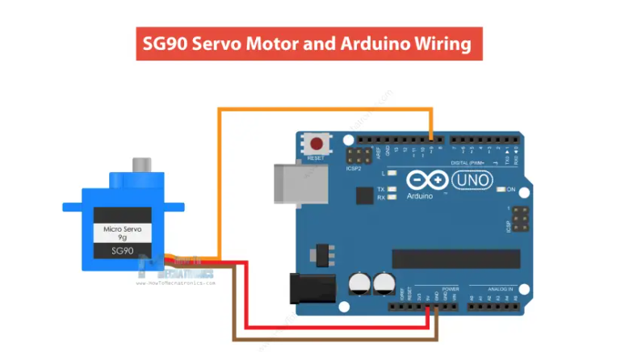
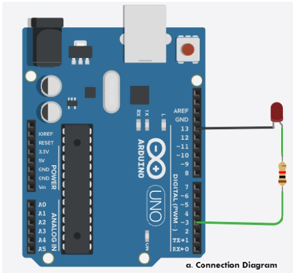
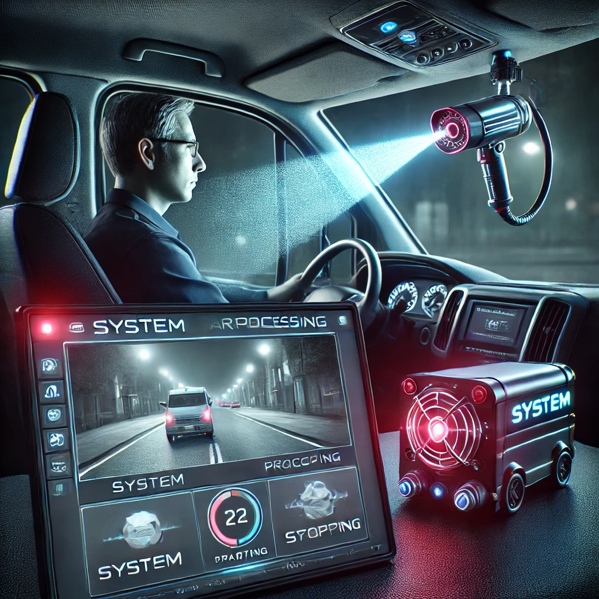
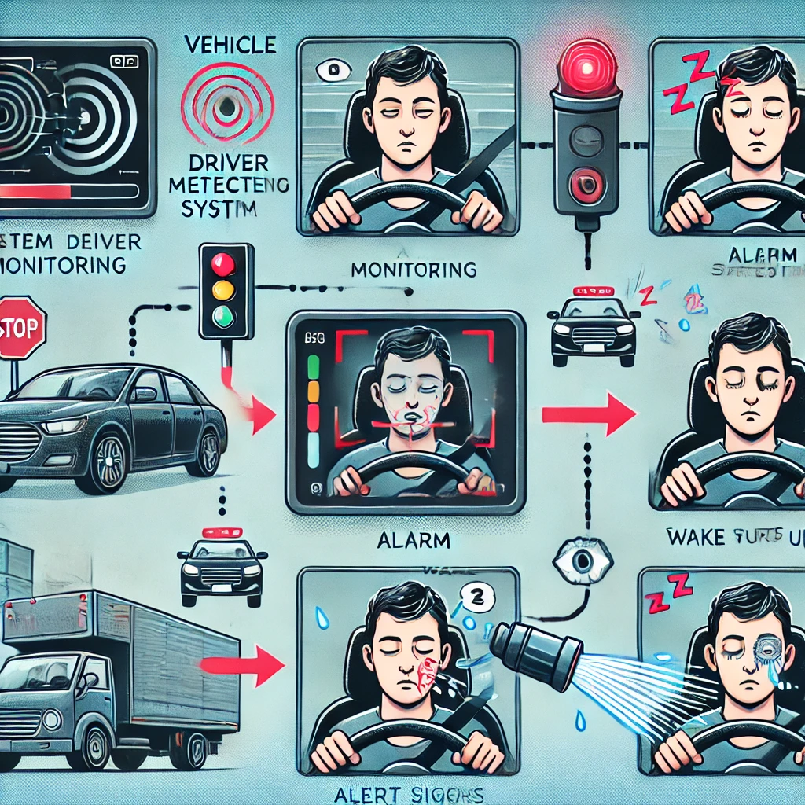

# Safe Driving System

The **Safe Driving System** is designed to enhance the safety of vehicle drivers by monitoring their alertness while driving. If the system detects drowsiness, it takes immediate action to wake the driver using a combination of audio alarms, LED lights, and a water spray mechanism.

---

## ✨ Features:

- **Drowsiness Detection:** Utilizes a camera to monitor the driver's face and detect signs of drowsiness.

- **Audio Alarm:** Plays an alarm sound to alert the driver.

- **LED Blinking:** Activates a red LED light to visually warn the driver.

- **Water Spray:** Sprays water onto the driver's face to ensure they regain alertness.

- **Real-Time Monitoring:** Processes video input in real-time for continuous monitoring.

---

## ⚙️ How It Works:

1. **Camera Initialization:** The system activates the camera to monitor the driver's face.

2. **Drowsiness Detection:** Using Mediapipe, the system analyzes facial landmarks to identify signs of drowsiness.

3. **Alert Mechanisms:** When drowsiness is detected:
   - An alarm sound is played.
   - A red LED light starts blinking (via Arduino).
   - A water spray mechanism is activated to wake the driver.

4. **Driver Recovery:** The system ensures the driver regains full alertness before resuming normal operation.

---

## 🧑‍💻 Technologies Used

### Programming Language:

- ***Python 3.12***

### Libraries Used:

- **OpenCV (`cv2`)**: For video processing and face detection.

- **Mediapipe**: For facial landmark detection and drowsiness analysis.

- **Time**: To control time-sensitive operations.

- **Distance**: For calculating proximity if necessary.

- **Pygame**: To play audio alarms.

- **Matplotlib**: For any required data visualization.

- **PyFirmata**: To communicate with the Arduino for controlling the LED and water spray.

- **Threading**: To handle multiple processes simultaneously (e.g., video processing, audio alarms).

---

## 🛠️ Hardware Components:

- **Arduino Board:** Used to control the hardware components, such as the LED and water spray system.

- **Camera:** Monitors the driver’s face in real time for drowsiness detection.  

- **LED Light (Red):** Provides a visual alert when drowsiness is detected (connected to pin 13).  

- **Water Spray Mechanism:** A relay-controlled spray to wake up the driver during critical moments.  

- **Relay Module:** Controls the activation of the water spray mechanism.

- **Power Supply:** Powers the Arduino and connected peripherals like the LED and relay.  

- **Jumper Wires:** Used to connect the components to the Arduino board.  

---


### 🔌 Arduino Board Connection


### 1. Servo Motor




### 2. LED Light




---

## 🛠️ Components Required

- **Arduino Board (e.g., Arduino Uno)**

- **LED (Red)**
  - Positive (Long Leg): Connect to pin 13 on the Arduino.

  - Negative (Short Leg): Connect to GND via a resistor (e.g., 220Ω).

- **Water Spray Mechanism (Relay)**
  - **Signal Pin (S):** Connect to pin 9 on the Arduino.

  - **VCC:** Connect to the Arduino’s 5V pin.

  - **GND:** Connect to the Arduino’s GND.

  - **NO (Normally Open):** Connect to one terminal of the water spray motor or solenoid valve.

  - **COM (Common):** Connect to the other terminal of the motor/valve.

- **Camera (USB Camera)**
  - Connect to your computer’s USB port for video capture.

- **Power Supply**
  - **USB Cable:** Connect the Arduino to your computer via USB for power and communication.

- **Jumper Wires**
  - Use jumper wires for secure and flexible connections between components and the Arduino board.

  ---

### 🔎 Finding the COM Port

To identify the COM port your Arduino is connected to on a Windows machine, follow these steps:

1. Plug in the Arduino using a USB cable.

2. Open **Device Manager**:
   - Press **Win + R**, type `devmgmt.msc`, and press **Enter**.

3. Look under the **Ports (COM & LPT)** section.

4. You should see a device named something like `Arduino Uno (COMX)`, where **X** is the COM port number (e.g., COM6).

---


## 📷 Demo

### 1. System Setup Demo



### 2. Driving Demo



### 3. Demo Video

[<video controls src="docs/Media/videos/demo_video.mp4" title="Title"></video>](https://github.com/user-attachments/assets/54910592-8e1d-475c-a4ae-9699fc7989bb)


## Setting Up the Python Program

The Python program will interact with the Arduino and camera. It will use libraries such as `pyserial` for Arduino communication and OpenCV for video capture and processing.

### 📚 Required Python Libraries

You will need the following Python libraries to run the project:

- `pyserial`: For serial communication with Arduino.

- `opencv-python`: For capturing and processing video from the camera.

- `mediapipe`: For facial or gesture detection.

- `time`: For handling timing and delays in the program.

- `distance`: For calculating distances (e.g., between facial landmarks).

- `pygame`: For handling the user interface or sound effects.

- `matplotlib`: For visualizing data such as graphs or camera frames.

- `pyfirmata`: For controlling the Arduino using the Firmata protocol.

- `threading`: For managing multiple processes in the program (e.g., camera capture and Arduino control).


### 📦 Install the required libraries using pip:

1. ```pip install pyserial```

2. ```pip install opencv-python```

3. ```pip install mediapipe ```

4. ```pip install time ```

5. ```pip install distance```

6. ```pip install pygame```

7. ```pip install matplotlib```

8. ```pip install pyfirmata```

9. ```pip install threading```

---

## 📞 Contact

- [Website](https://mpowerr.com/)
